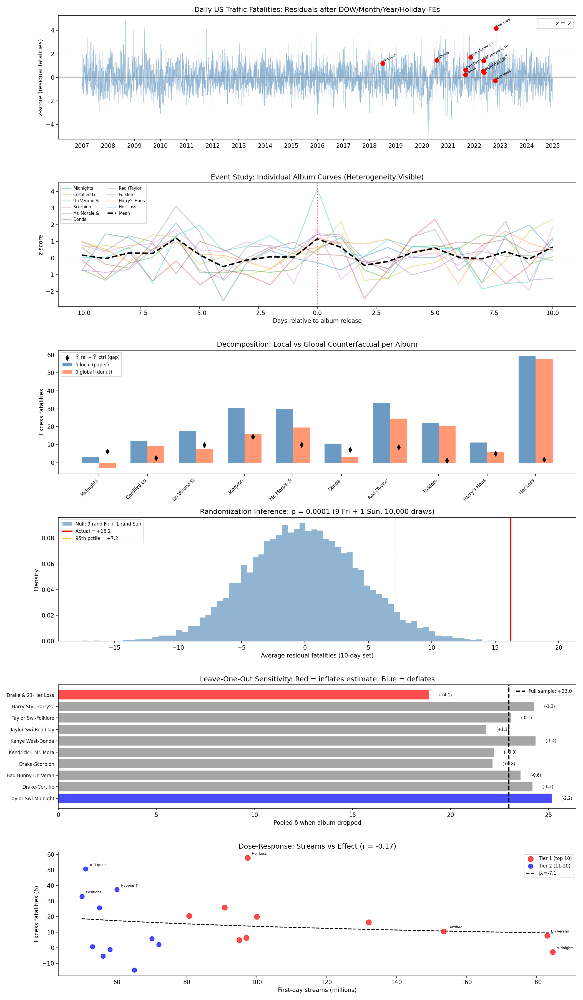

# FARCE: FARS Album Release Coincidence Examination

Replication and extended analysis of Patel, Worsham, Liu & Jena (2026), "[Smartphones, Online Music Streaming, and Traffic Fatalities](https://www.nber.org/papers/w34866)," NBER Working Paper 34866.

## Key Findings

### 1. The Statistical Effect Is Real

Traffic fatalities are elevated on major album release days:

| Estimator | Effect (Tier 1) | SE | t-stat |
|-----------|-----------------|-----|--------|
| Local (±10 day)* | +23.0 deaths | 5.1 | 4.5 |
| Donut-global | +16.2 deaths | 5.1 | 3.2 |
| Forecast | +22.8 deaths | 4.9 | 4.6 |

Randomization inference confirms significance (p < 0.001 across multiple strategies).

### 2. But The Causal Story Doesn't Hold Up

**No dose-response relationship:**

| Album | Streams | Effect |
|-------|---------|--------|
| Tortured Poets (2024) | 313M | **-2** deaths |
| Her Loss (2022) | 97M | **+63** deaths |
| Midnights (2022) | 185M | **+5** deaths |

Pearson r = **-0.18** (negative correlation — more streams → *smaller* effects)

**Out-of-sample replication fails (2023-2024):**

The paper analyzed 2017-2022 releases. We tested 7 major 2023-2024 albums as a true out-of-sample test:

| Album | Streams | Effect |
|-------|---------|--------|
| Tortured Poets | 313M | -2.1 |
| UTOPIA | 128M | +10.5 |
| For All The Dogs | 109M | -12.8 |
| Cowboy Carter | 76M | -0.4 |
| Hit Me Hard and Soft | 73M | +7.0 |
| SOS | 68M | +9.4 |
| One Thing at a Time | 52M | -1.5 |

**Average effect: +1.4 deaths** (vs. +22.8 for original sample). The biggest streaming day in Spotify history (Tortured Poets, 313M) shows a *negative* effect. The pattern found in 2017-2022 does not replicate forward.

**Single outlier dominates:** Her Loss accounts for 34% of the total Tier 1 effect.

### 3. Methodology Concerns

**The ±10 day estimator uses post-treatment days as controls.** The paper compares release-day fatalities to the average of the surrounding ±10 days—but this includes days *after* the release. Standard event studies use only pre-treatment periods. If the effect persists beyond day 0, the control mean is biased upward.

## What The Paper Claims

Patel et al. (2026) find:
- 139.1 deaths on release days vs 120.9 on control days (+18.2 deaths, +15%)
- 123.3M streams on release days vs 86.1M control (+43%)
- Proposed mechanism: smartphone distraction from streaming while driving

## What We Did

| Analysis | Description |
|----------|-------------|
| Extended data | FARS 2007-2024 (vs. 2017-2022) |
| Forecast estimator | Train model on non-release days, predict counterfactual |
| Dose-response | Test if more streams → more deaths |
| Extended sample | Added 2023-2024 albums (27 total vs. original 10) |
| Placebo tests | Pre-trends, year permutation, window sensitivity |

## Results Summary

| Finding | Result | Interpretation |
|---------|--------|----------------|
| In-sample effect | +22.8 deaths/release | Statistically significant (2017-2022) |
| **Out-of-sample** | **+1.4 deaths/release** | **Effect vanishes in 2023-2024** |
| Dose-response | r = -0.18 | Wrong sign for causal story |
| Her Loss outlier | 34% of total effect | Results driven by one album |
| Tier 2 ratio | 0.80 (expected 0.50) | Effect doesn't scale with streams |

## Output Tables

| File | Description |
|------|-------------|
| [t01_local_estimates.csv](tabs/t01_local_estimates.csv) | Per-album local δ |
| [t02_global_estimates.csv](tabs/t02_global_estimates.csv) | Per-album global δ |
| [t03_dose_response.csv](tabs/t03_dose_response.csv) | Streams vs effect |
| [t04_tier_comparison.csv](tabs/t04_tier_comparison.csv) | Tier 1 vs Tier 2 |
| [t05_randomization_inference.csv](tabs/t05_randomization_inference.csv) | RI p-values |
| [t06_leave_one_out.csv](tabs/t06_leave_one_out.csv) | Jackknife analysis |
| [t07_summary.csv](tabs/t07_summary.csv) | Summary statistics |
| [t08_placebo_tests.csv](tabs/t08_placebo_tests.csv) | Placebo results |
| [t09_window_sensitivity.csv](tabs/t09_window_sensitivity.csv) | Window sensitivity |
| [t10_forecast_estimates.csv](tabs/t10_forecast_estimates.csv) | Forecast estimates |
| [t11_forecast_summary.csv](tabs/t11_forecast_summary.csv) | Forecast summary |

## Usage

```bash
# Install dependencies
pip install pandas numpy matplotlib scipy requests scikit-learn

# Run analysis
make extract        # Extract FARS CSVs from zips
make run            # Run main analysis
make run-forecast   # Run forecast estimator (standard sample)

# Extended analysis (includes 2023-2024 albums)
python3 -m src.s06_forecast --extended
```

### Data

1. Download FARS zip files from [NHTSA](https://www.nhtsa.gov/file-downloads) → `data/raw/`
2. Run `make extract` to extract accident CSVs
3. Album data in `data/albums.csv` with sources in `data/albums_sources.md`

## Repository Structure

```
farce/
├── Makefile                 # Build commands
├── README.md
│
├── data/
│   ├── albums.csv           # Album release dates & streams (sourced)
│   ├── albums_sources.md    # Data provenance
│   ├── fars/                # Extracted accident CSVs (not tracked)
│   └── raw/                 # FARS zip files (not tracked)
│
├── src/
│   ├── constants.py         # Load albums from CSV
│   ├── s01_load.py          # FARS data loading
│   ├── s02_preprocess.py    # Daily aggregation, residualization
│   ├── s03_core.py          # Local/global estimators, RI, dose-response
│   ├── s04_placebo.py       # Placebo tests
│   ├── s05_visualize.py     # Plotting
│   ├── s06_forecast.py      # Forecast-based estimator
│   └── pipeline.py          # Main entry point
│
├── tabs/                    # Output tables (CSV)
└── figs/                    # Output figures (PNG)
```

## Visualization



## Data Sources

- **FARS**: [NHTSA Fatality Analysis Reporting System](https://www.nhtsa.gov/research-data/fatality-analysis-reporting-system-fars) (2007-2024)
- **Streaming**: Spotify Newsroom, Billboard, Chart Data (see `data/albums_sources.md`)

## References

- Patel, Worsham, Liu & Jena (2026). "[Smartphones, Online Music Streaming, and Traffic Fatalities](https://www.nber.org/papers/w34866)." NBER Working Paper 34866.
- [Harvard Gazette coverage](https://news.harvard.edu/gazette/story/2026/02/streaming-a-new-album-release-while-driving-may-increase-risk-of-fatal-car-accidents/)
- [Freakonomics](https://freakonomics.com/podcast/do-taylor-swift-and-bad-bunny-have-blood-on-their-hands/)
- [NYT](https://www.nytimes.com/2026/04/10/well/car-crashes-streaming-friday-harvard.html)