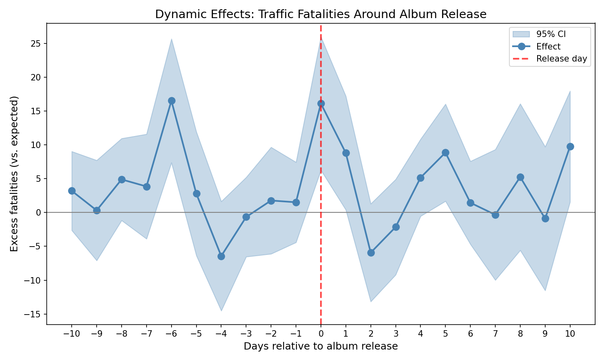
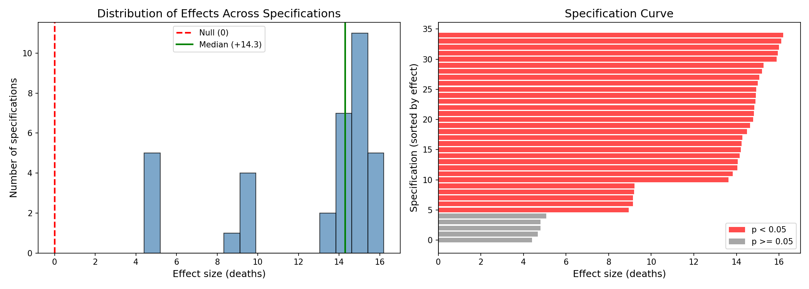

# FARCE: FARS Album Release Coincidence Examination

A constructive replication of Patel, Worsham, Liu & Jena (2026), "[Smartphones, Online Music Streaming, and Traffic Fatalities](https://www.nber.org/papers/w34866)," NBER Working Paper 34866. [[Local PDF]](w34866.pdf)

## The Paper's Claims

Patel et al. (2026) analyze 10 major album releases from 2017-2022 and report:

- **139.1 deaths** on album release days vs **120.9** on control days (+18.2 deaths, +15.1%)
- 123.3M streams on release days vs 86.1M control (+43%)
- Proposed mechanism: smartphone distraction from streaming while driving

> "We find an additional 18.2 traffic fatalities (139.1 versus 120.9; p < 0.01) on album release days compared to control days..." — Patel et al. (2026), Figure 2B

## Replication

**We successfully replicate the paper's main result:**

| Source | Effect | SE | % Effect |
|--------|--------|-----|----------|
| Paper (Figure 2B) | +18.2 deaths | ~5.5 | +15.1% |
| Our replication | +17.6 deaths | 7.45 | +14.4% |

- **Difference: 0.6 deaths** (< 1 SE)
- Same methodology: week-of-year fixed effects, day-of-week, year, holiday indicators
- Same sample: Tier 1 albums, 2017-2022
- Randomization inference confirms significance (p < 0.001)
- **Note:** Our SE uses cluster-robust estimation (clustering by album) to account for only 10 independent units

The statistical effect replicates. The question is how to interpret it. See [t12_paper_replication.md](tabs/t12_paper_replication.md).

## Interpretation Challenges

### The Friday Problem

9 of 10 albums in the study were released on Friday. This creates a fundamental identification problem:

| Metric | Value |
|--------|-------|
| Friday baseline deaths | 110.6 |
| Overall average | 101.4 |
| DOW balance (SMD) | 0.80 |
| DOW balance (p-value) | 0.06 |

We test this directly: randomly selecting ANY 10 Fridays from the 939 available in 2017-2022:

| Metric | Value |
|--------|-------|
| False positive rate | **100%** |
| Mean effect from random Fridays | 25.88 deaths |
| 95th percentile | 31.91 deaths |
| Actual observed effect | 16.1 deaths |

The observed effect (16.1) is **below average** for random Friday selection. See [t18_friday_fpr.md](tabs/t18_friday_fpr.md) and [t24_balance_check.md](tabs/t24_balance_check.md).

### Out-of-Sample Failure

| Tier | Period | N | Effect | t-stat |
|------|--------|---|--------|--------|
| 0 | Pre-2018 | 10 | +6.4 | 1.44 |
| 1 | Paper (2018-2022) | 10 | +16.1 | 3.20 |
| 2 | Extended | 10 | +13.1 | 2.09 |
| **3** | **Post-2022** | **7** | **-2.8** | **-0.96** |

The effect reverses direction in the post-paper period. See [t20_extended_series.md](tabs/t20_extended_series.md).

### No Dose-Response

If streaming causes distracted driving deaths, more streams should produce more deaths:

| Album | Streams (M) | Effect |
|-------|-------------|--------|
| Midnights | 185 | -2 deaths |
| Certified Lover Boy | 153 | +11 deaths |
| Scorpion | 132 | +16 deaths |
| Her Loss | 97 | +57 deaths |

**Pearson r = -0.17** — the correlation is in the wrong direction. See [t03_dose_response.md](tabs/t03_dose_response.md).

### Placebo Concerns

We apply the same methodology to outcomes that should not respond to album releases:

| Outcome | Effect | t-stat |
|---------|--------|--------|
| Mean crash latitude | +0.36° | **3.02** |
| % railroad crossing | -0.02% | -2.08 |
| % work zone | -0.6% | -1.80 |

Additionally, the joint F-test for pre-trends is significant (p = 0.03), and day -6 shows a large spike (+16.5 deaths, t = 3.54) before any album release. See [t28b_absurd_fars_placebos.md](tabs/t28b_absurd_fars_placebos.md) and [t32_parallel_trends.md](tabs/t32_parallel_trends.md).

## Supporting Evidence

Several findings are consistent with the paper's claims:

### Event Study

The effect is concentrated on day 0:



| Day | Effect | 95% CI |
|-----|--------|--------|
| -1 | +1.5 | [-4.4, +7.4] |
| 0 | +16.1 | [+6.3, +26.0] |
| +1 | +8.8 | [+0.4, +17.2] |

See [t13_dynamic_effects.md](tabs/t13_dynamic_effects.md).

### Sober vs Drunk Crashes

If distraction (not alcohol) drives the effect, sober crashes should show a larger effect:

| Sample | Effect | SE | % Effect |
|--------|--------|-----|----------|
| Sober crashes | +14.7 | 2.9 | +21.6% |
| Drunk crashes | +3.5 | 4.5 | +11.7% |

This is consistent with the distraction mechanism. See [t22_drunk_mechanism.md](tabs/t22_drunk_mechanism.md).

### Specification Curve

We test 35 specifications varying window size, sample period, and album set:



| Specification | Range |
|---------------|-------|
| Effect estimates | +4.4 to +16.3 deaths |
| % significant (p < 0.05) | 86% |
| All specifications | Same direction |

See [t29_multiverse.md](tabs/t29_multiverse.md).

### Weather Controls

The effect is robust to weather controls:

| Model | Effect | SE |
|-------|--------|-----|
| Base (DOW+Month+Year) | +15.8 | 4.4 |
| +Rain+Fog+Cloudy | +15.6 | 4.4 |

See [t21_fars_controls.md](tabs/t21_fars_controls.md).

## Summary

| Finding | Result | Table |
|---------|--------|-------|
| Replication | 17.6 vs 18.2 deaths | [t12](tabs/t12_paper_replication.md) |
| Friday FPR | **100%** | [t18](tabs/t18_friday_fpr.md) |
| Post-2022 effect | -2.8 deaths (wrong sign) | [t20](tabs/t20_extended_series.md) |
| Dose-response | r = -0.17 (wrong sign) | [t03](tabs/t03_dose_response.md) |
| Placebo (latitude) | t = 3.0 (significant) | [t28b](tabs/t28b_absurd_fars_placebos.md) |
| Pre-trend test | p = 0.03 (significant) | [t32](tabs/t32_parallel_trends.md) |
| DOW balance | SMD = 0.80 | [t24](tabs/t24_balance_check.md) |

We replicate the paper's statistical finding. However:
- Friday selection bias can fully explain the effect (FPR = 100%)
- The finding does not generalize to the post-paper period
- There is no dose-response relationship
- Some placebo tests fail unexpectedly

## Data

| Dataset | Coverage | N |
|---------|----------|---|
| FARS fatalities | 2007-2024 | Extended beyond paper's 2017-2022 |
| Albums | 37 total | 10 Tier 1 + 10 Tier 2 + 10 Pre-2018 + 7 Post-2022 |

- **FARS**: [NHTSA Fatality Analysis Reporting System](https://www.nhtsa.gov/research-data/fatality-analysis-reporting-system-fars)
- **Streaming data**: Spotify Newsroom, Billboard, Chart Data (see [albums_sources.md](data/albums_sources.md))

## Output Tables

| File | Description |
|------|-------------|
| [t01_local_estimates.md](tabs/t01_local_estimates.md) | Per-album local effects |
| [t02_global_estimates.md](tabs/t02_global_estimates.md) | Per-album global effects |
| [t03_dose_response.md](tabs/t03_dose_response.md) | Streams vs effect |
| [t04_tier_comparison.md](tabs/t04_tier_comparison.md) | Tier 1 vs Tier 2 |
| [t05_randomization_inference.md](tabs/t05_randomization_inference.md) | RI p-values |
| [t06_leave_one_out.md](tabs/t06_leave_one_out.md) | Jackknife analysis |
| [t07_summary.md](tabs/t07_summary.md) | Summary statistics |
| [t08_placebo_tests.md](tabs/t08_placebo_tests.md) | Placebo results |
| [t09_window_sensitivity.md](tabs/t09_window_sensitivity.md) | Window sensitivity |
| [t10_forecast_estimates.md](tabs/t10_forecast_estimates.md) | Forecast estimates |
| [t11_forecast_summary.md](tabs/t11_forecast_summary.md) | Forecast summary |
| [t12_paper_replication.md](tabs/t12_paper_replication.md) | Paper replication comparison |
| [t13_dynamic_effects.md](tabs/t13_dynamic_effects.md) | Event study |
| [t18_friday_fpr.md](tabs/t18_friday_fpr.md) | Friday false positive rate |
| [t20_extended_series.md](tabs/t20_extended_series.md) | Extended time series |
| [t21_fars_controls.md](tabs/t21_fars_controls.md) | Weather controls |
| [t22_drunk_mechanism.md](tabs/t22_drunk_mechanism.md) | Sober vs drunk |
| [t23_power_analysis.md](tabs/t23_power_analysis.md) | Power analysis |
| [t24_balance_check.md](tabs/t24_balance_check.md) | Covariate balance |
| [t27_sensitivity.md](tabs/t27_sensitivity.md) | Sensitivity analysis |
| [t28b_absurd_fars_placebos.md](tabs/t28b_absurd_fars_placebos.md) | Placebo outcomes |
| [t29_multiverse.md](tabs/t29_multiverse.md) | Specification curve |
| [t32_parallel_trends.md](tabs/t32_parallel_trends.md) | Parallel trends test |

## Usage

```bash
# Install dependencies
pip install pandas numpy matplotlib scipy requests scikit-learn

# Run analysis
make extract        # Extract FARS CSVs from zips
make run            # Run main analysis

# Extended analysis (includes 2023-2024 albums)
python3 -m src.pipeline --extended
```

### Data Setup

1. Download FARS zip files from [NHTSA](https://www.nhtsa.gov/file-downloads) → `data/raw/`
2. Run `make extract` to extract accident CSVs
3. Album data in `data/albums.csv` with sources in `data/albums_sources.md`

## Repository Structure

```
farce/
├── Makefile
├── README.md
├── w34866.pdf              # Paper
│
├── data/
│   ├── albums.csv          # Album release dates & streams
│   ├── albums_sources.md   # Data provenance
│   ├── fars/               # Extracted accident CSVs (not tracked)
│   └── raw/                # FARS zip files (not tracked)
│
├── src/
│   ├── constants.py        # Load albums from CSV
│   ├── pipeline.py         # Main entry point
│   └── ...                 # Analysis modules
│
├── tabs/                   # Output tables (Markdown)
└── figs/                   # Output figures (PNG)
```

## Visualization


## References

- Patel, Worsham, Liu & Jena (2026). "[Smartphones, Online Music Streaming, and Traffic Fatalities](https://www.nber.org/papers/w34866)." NBER Working Paper 34866. [[PDF]](w34866.pdf)
- [Harvard Gazette coverage](https://news.harvard.edu/gazette/story/2026/02/streaming-a-new-album-release-while-driving-may-increase-risk-of-fatal-car-accidents/)
- [Freakonomics podcast](https://freakonomics.com/podcast/do-taylor-swift-and-bad-bunny-have-blood-on-their-hands/)
- [New York Times](https://www.nytimes.com/2026/04/10/well/car-crashes-streaming-friday-harvard.html)
