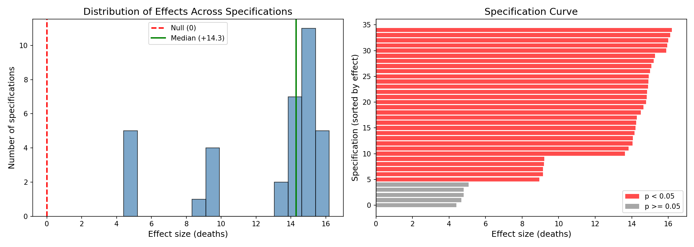
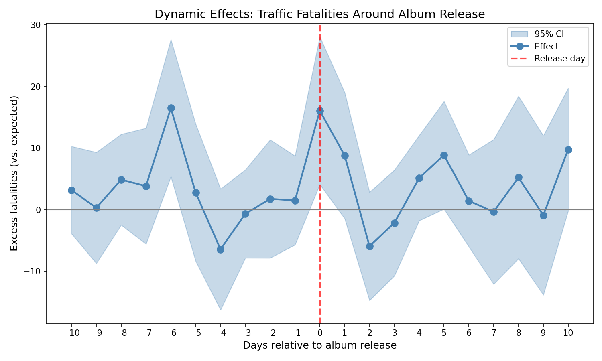
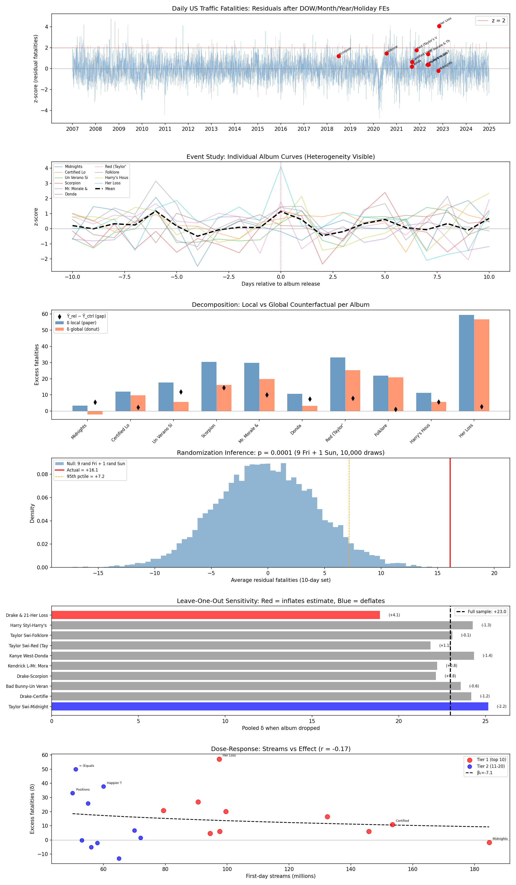

# FARCE: FARS Album Release Coincidence Examination

A constructive replication of Patel, Worsham, Liu & Jena (2026), "[Smartphones, Online Music Streaming, and Traffic Fatalities](https://www.nber.org/papers/w34866)," NBER Working Paper 34866. [[Local PDF]](w34866.pdf)

> **Status.** A correctness audit of this repository (see [AUDIT.md](AUDIT.md)) found that
> several of the original critique's central claims rested on defective code. They have been
> corrected here. **The manuscript in [`ms/`](ms/) predates those corrections and should not be
> circulated** — see [ms/README.md](ms/README.md) for the specific claims that no longer hold.

## The Paper's Claims

Patel et al. (2026) analyze 10 major album releases from 2018-2022 (selected as the most-streamed
single-day releases in a 2017-2022 window) and report:

- **139.1 deaths** on album release days vs **120.9** on control days (+18.2 deaths, +15.1%)
- 123.3M streams on release days vs 86.1M control (+43%)
- Proposed mechanism: smartphone distraction from streaming while driving

> "We find an additional 18.2 traffic fatalities (139.1 versus 120.9; p < 0.01) on album release days compared to control days..." — Patel et al. (2026), Figure 2B

## Replication

**We closely replicate the paper's main result:**

| Source | Effect | SE | % Effect |
|--------|--------|-----|----------|
| Paper (Figure 2B) | +18.2 deaths | ~5.5 | +15.1% |
| Our replication | +17.6 deaths | 7.45 | +14.4% |

- **Difference: 0.6 deaths** (well within one standard error)
- Same specification: day-of-week, week-of-year, year, and federal-holiday fixed effects, ±10 day window
- Same ten albums and dates as the paper's Table 1 (asserted by `check_album_list` in [src/gates.py](src/gates.py))
- Our SE clusters by album. With **10 clusters** the honest interval is a t₉ one: **95% CI [0.8, 34.5], p = 0.042**
- The percentage uses the control-day mean (121.9), matching the paper's 120.9 denominator. The raw release-day mean is 144.9

The statistical effect replicates. The question is how to interpret it. See [t12_paper_replication.md](tabs/t12_paper_replication.md).

## What Holds Up

### Robustness across specifications

35 estimates from 7 distinct album-set × sample-period configurations × 5 window widths (±5 to ±21 days).



| Specification | Range |
|---------------|-------|
| Effect estimates | +4.4 to +16.2 deaths |
| Significant (p < 0.05) | **30 of 35** |
| All specifications | Same direction |

The five nulls are the same configuration (pre-2018 albums) at five window widths. Read as
distinct configurations rather than as 35 independent tests: **6 of 7 are significant, and the
only null is the pre-2018 sample.** Widening the window from ±5 to ±21 moves the Tier 1 estimate
by less than two deaths, so the count of 35 is mostly the same answer five times over.
See [t29_multiverse.md](tabs/t29_multiverse.md).

### The effect is concentrated on day 0



| Day | Weekday (9/10 albums) | Effect | 95% CI |
|-----|------|--------|--------|
| −7 | **Friday** | +3.8 | [−5.6, +13.3] |
| −6 | Saturday | +16.5 | [+5.4, +27.6] |
| −1 | Thursday | +1.5 | [−5.7, +8.7] |
| **0** | **Friday** | **+16.1** | **[+4.1, +28.1]** |
| +1 | Saturday | +8.8 | [−1.4, +19.0] |
| +7 | **Friday** | −0.3 | [−11.7, +11.0] |

Day 0 is the largest coefficient and is significant (t = 3.04). Day +1 is **not** (t = 1.94,
p = 0.08) — an earlier version reported t = 2.05 using a normal critical value and a
ddof = 0 standard error. See [t13_dynamic_effects.md](tabs/t13_dynamic_effects.md).

### Weather does not explain it

| Model | Effect | SE |
|-------|--------|-----|
| Base (DOW+Month+Year) | +15.83 | 4.38 |
| +Rain+Fog+Cloudy | +15.64 | 4.36 |
| +All bad weather | +15.95 | 4.37 |

See [t21_fars_controls.md](tabs/t21_fars_controls.md).

### Friday releases are an industry convention, not a researcher choice

Since 2015, Friday has been the global standard release day for new music ("New Music Friday"),
established by the IFPI. All nine Friday releases in the study follow that norm.

## The Friday Question, Answered

Nine of the ten releases are Fridays, and Fridays are high-fatality days in raw counts
(2017-2022: Friday mean 117.6 vs 107.5 overall). Does the release-day estimate just recover a
Friday effect?

**No.** After the paper's fixed effects there is essentially no Friday contrast left to recover:
the mean residual on Fridays is **+0.14 deaths**. Drawing ten Fridays at random and running them
through the same estimator:

| Scheme | Null mean | Null SD | Null p95 | Draws ≥ +16.1 | p |
|--------|-----------|---------|----------|---------------|---|
| 10 random Fridays (2007-2024) | −0.02 | 4.52 | +7.5 | 3 / 10,000 | **0.0003** |
| 10 random Fridays (2017-2022) | +0.77 | 4.88 | +8.8 | 8 / 10,000 | **0.0008** |
| 9 random Fridays + 1 random Sunday | −0.02 | 4.52 | +7.3 | 2 / 10,000 | **0.0002** |

Observed effect: +16.1, roughly three and a half null standard deviations out.
See [t18_friday_placebo.md](tabs/t18_friday_placebo.md). This agrees with the paper's own
falsification test (20 of 1,000 random-Friday iterations exceeded their estimate) and with the
randomization inference in [t05_randomization_inference.md](tabs/t05_randomization_inference.md).

> **Correction.** Earlier versions of this repository reported a "100% false positive rate" from
> random Fridays. That simulation drew 100 Fridays and kept the **ten largest residuals**. It
> measures how much an analyst could manufacture by choosing dates, not whether Fridays are
> confounded — the same procedure on Tuesdays gives 99%. It is kept, correctly labeled, in
> [t18b_cherry_pick_benchmark.md](tabs/t18b_cherry_pick_benchmark.md).

The day −6 spike is likewise not a Friday artifact: **day −6 is the Saturday before release**;
the previous Friday is day −7, and it is flat (+3.8, p = 0.38). The joint test that pre-treatment
days are flat, using album-level sign flips that respect the fact that the same ten albums
generate every coefficient, gives **p = 0.19** — and **p = 0.70** with day −6 removed.
See [t32_parallel_trends.md](tabs/t32_parallel_trends.md).

Day-of-week imbalance is nonetheless extreme and worth stating plainly: 90% of release days are
Fridays versus 12% of control days (Fisher exact p < 0.001). What the placebo shows is that the
paper's fixed effects absorb it. See [t24_balance_check.md](tabs/t24_balance_check.md).

## What Remains Fragile

### Out-of-sample behavior

| Tier | Period | N | Effect | 95% CI |
|------|--------|---|--------|--------|
| 0 | Pre-2018 | 10 | +6.4 | [−4.2, +17.0] |
| 1 | Paper (2018-2022) | 10 | +16.1 | [+4.1, +28.1] |
| 2 | Extended | 10 | +13.1 | [−1.9, +28.0] |
| **3** | **Post-2022** | **7** | **−2.8** | **[−10.3, +4.8]** |

The effect does not appear for seven major 2023-2024 releases. Note this is estimator-dependent:
the paper-specification regression on Tier 3 gives −8.0 (SE 7.56), the residual mean gives −2.8,
and the raw release-day-versus-window comparison — the unadjusted analogue of the paper's own
139.1 vs 120.9 — gives **+5.6**. All three straddle zero. See [t20_extended_series.md](tabs/t20_extended_series.md).

### Dependence on one album

Leave-one-out: dropping *Her Loss* (4 Nov 2022, local δ = +59.5) moves the pooled local mean from
+23.0 to +18.9. A broad behavioral mechanism should not lean this hard on one treated unit.
See [t06_leave_one_out.md](tabs/t06_leave_one_out.md).

### No detectable dose-response — but the test has no power

| Album | Streams (M) | Effect |
|-------|-------------|--------|
| Midnights | 184.7 | −1.8 |
| Certified Lover Boy | 153.4 | +11.0 |
| Un Verano Sin Ti | 145.8 | +6.0 |
| Scorpion | 132.4 | +16.4 |
| Her Loss | 97.4 | +57.2 |

Pearson r = **−0.17 across the 20 Tier 1+2 albums, p = 0.48, 95% CI [−0.57, +0.30]**. The interval
contains a substantial positive dose-response, so this is an absence of evidence rather than
evidence of absence. Two further caveats: Tier-1-only gives r = −0.50 (p = 0.15), and eight of the ten Tier 2
streaming counts are **estimated from chart position rather than measured**
(see [albums_sources.md](data/albums_sources.md)), so half the x-axis is constructed.
See [t03_dose_response.md](tabs/t03_dose_response.md).

### Small number of treated units

Ten release days. Both the original estimate and every diagnostic here inherit that.
The replication's own p-value is 0.042, not p < 0.01.

### Crash composition shifts

| Outcome | Effect | p |
|---------|--------|---|
| Mean crash latitude | +0.37° | 0.02 |
| Mean crash longitude | −0.19° | 0.59 |
| Mean vehicles per crash | +0.00 | 0.97 |

Fatal crashes on release days sit about 0.37 degrees farther north than the model predicts.
This is **not** a placebo failure, contrary to how an earlier version of this repository
described it: mean latitude is a summary of the same crashes whose count is the outcome, so it
moves whenever the extra crashes are geographically non-uniform. It says something about *where*,
not about whether the estimator is picking up noise.
See [t28b_structural_fars_composition.md](tabs/t28b_structural_fars_composition.md).

### Overlapping event windows

Six of the 200 control-day rows are themselves other albums' release days (Donda ↔ Certified
Lover Boy, 5 days apart; Un Verano ↔ Mr. Morale ↔ Harry's House, 7 days apart). Treated days
serving as controls biases the pooled estimate toward zero. This affects the original paper
equally. The `window_overlap` gate reports it on every run.

### The sober-versus-drunk mechanism test rests on two albums

`DRUNK_DR` leaves the FARS accident file after 2020, so only *Scorpion* (2018) and *Folklore*
(2020) survive. The point estimates (+14.7 with no driver at BAC ≥ 0.08, +3.5 with one) are a
description of two dates; no standard error is reportable and none is shown.
See [t22_drunk_mechanism.md](tabs/t22_drunk_mechanism.md).

## Where The Evidence Points

| Evidence | Finding | Reading |
|----------|---------|---------|
| Replication | +17.6 vs +18.2 | The result is not a coding artifact |
| Random-Friday placebo | p = 0.0003 | Day-of-week does **not** explain it |
| Pre-trend joint test | p = 0.19 | No systematic pre-trends |
| Specification multiverse | 6 of 7 configurations significant | Not a single-specification artifact |
| Effect concentrated on day 0 | t = 3.04 | Event-specific timing |
| Post-2022 | −2.8 [−10.3, +4.8] | Does not reappear out of sample |
| Dose-response | r = −0.17, CI [−0.57, +0.30] | Uninformative, not contrary |
| Ten treated units | p = 0.042 | Inference is fragile at this N |

## Bottom Line

The paper's estimate replicates closely and survives the diagnostics that were supposed to
overturn it. The Friday concentration, which looked like the obvious confound, is absorbed by the
paper's own fixed effects: random Fridays reproduce it 3 times in 10,000, and the previous Friday in
the event window is flat.

What is left is a genuinely small-sample result. Ten release days, an estimate that depends
noticeably on one of them, no reappearance in 2023-2024, and a dose-response test too weak to
discriminate. That is a reason to want more treated units, not a reason to think the anomaly is
a day-of-week artifact.

## Data

| Dataset | Coverage | N |
|---------|----------|---|
| FARS fatalities | 2007-2024 | 6,575 days; annual totals gated against the FARS Final File |
| Albums | 37 total | 10 Tier 1 (paper) + 10 Tier 2 + 10 pre-2018 + 7 post-2022 |

- **FARS**: [NHTSA Fatality Analysis Reporting System](https://www.nhtsa.gov/research-data/fatality-analysis-reporting-system-fars)
- **Streaming**: Tier 1 from the paper's Table 1; Tier 2 estimated from chart position; Tier 0 unsourced placeholders, unused in any dose-response. See [albums_sources.md](data/albums_sources.md)

## Output Tables

| File | Description |
|------|-------------|
| [t01_local_estimates.md](tabs/t01_local_estimates.md) | Per-album local effects |
| [t02_global_estimates.md](tabs/t02_global_estimates.md) | Per-album global effects |
| [t03_dose_response.md](tabs/t03_dose_response.md) | Streams vs effect |
| [t04_tier_comparison.md](tabs/t04_tier_comparison.md) | Tier 1 vs Tier 2 |
| [t05_randomization_inference.md](tabs/t05_randomization_inference.md) | RI p-values |
| [t06_leave_one_out.md](tabs/t06_leave_one_out.md) | Jackknife analysis |
| [t07_summary.md](tabs/t07_summary.md) | Summary statistics |
| [t08_placebo_tests.md](tabs/t08_placebo_tests.md) | Placebo results |
| [t09_window_sensitivity.md](tabs/t09_window_sensitivity.md) | Window sensitivity |
| [t10_forecast_estimates.md](tabs/t10_forecast_estimates.md) | Forecast estimates |
| [t11_forecast_summary.md](tabs/t11_forecast_summary.md) | Forecast summary |
| [t12_paper_replication.md](tabs/t12_paper_replication.md) | Paper replication comparison |
| [t13_dynamic_effects.md](tabs/t13_dynamic_effects.md) | Event study |
| [t18_friday_placebo.md](tabs/t18_friday_placebo.md) | Random-Friday placebo |
| [t18b_cherry_pick_benchmark.md](tabs/t18b_cherry_pick_benchmark.md) | Date-selection benchmark (not a placebo) |
| [t20_extended_series.md](tabs/t20_extended_series.md) | Extended time series |
| [t21_fars_controls.md](tabs/t21_fars_controls.md) | Weather controls |
| [t22_drunk_mechanism.md](tabs/t22_drunk_mechanism.md) | BAC split (n = 2) |
| [t23_power_analysis.md](tabs/t23_power_analysis.md) | Power analysis |
| [t24_balance_check.md](tabs/t24_balance_check.md) | Covariate balance |
| [t27_sensitivity.md](tabs/t27_sensitivity.md) | Sensitivity analysis |
| [t28b_structural_fars_composition.md](tabs/t28b_structural_fars_composition.md) | Crash composition on release days |
| [t29_multiverse.md](tabs/t29_multiverse.md) | Specification curve |
| [t32_parallel_trends.md](tabs/t32_parallel_trends.md) | Parallel trends test |

## Usage

```bash
pip install -r requirements.txt

make extract        # Extract FARS CSVs from zips
make run            # Run the full analysis
make lint           # black, isort, flake8
```

### Data Setup

1. Download FARS zip files from [NHTSA](https://www.nhtsa.gov/file-downloads) → `data/raw/`
2. Run `make extract` to extract accident CSVs
3. Album data in `data/albums.csv` with sources in `data/albums_sources.md`

### Build gates

`src/gates.py` runs at the top of every pipeline invocation and raises, rather than warns, if:

- Tier 1 drifts from the paper's Table 1 (albums, dates, or streaming counts)
- The daily series has gaps or duplicate dates
- Annual fatality totals do not match the FARS Final File

It also reports how many control-day rows are contaminated by other releases. Two further
guards live in the estimation code: `build_design_matrix` raises on a requested control column
it cannot find (silently dropping them once turned three rows of the weather table into
copies of the base model), and `album_stats` returns no standard error below five treated
units (which is what produced a t of −27 from three albums).

## Visualization



## References

- Patel, Worsham, Liu & Jena (2026). "[Smartphones, Online Music Streaming, and Traffic Fatalities](https://www.nber.org/papers/w34866)." NBER Working Paper 34866. [[PDF]](w34866.pdf)
- [Harvard Gazette coverage](https://news.harvard.edu/gazette/story/2026/02/streaming-a-new-album-release-while-driving-may-increase-risk-of-fatal-car-accidents/)
- [Freakonomics podcast](https://freakonomics.com/podcast/do-taylor-swift-and-bad-bunny-have-blood-on-their-hands/)
- [New York Times](https://www.nytimes.com/2026/04/10/well/car-crashes-streaming-friday-harvard.html)
