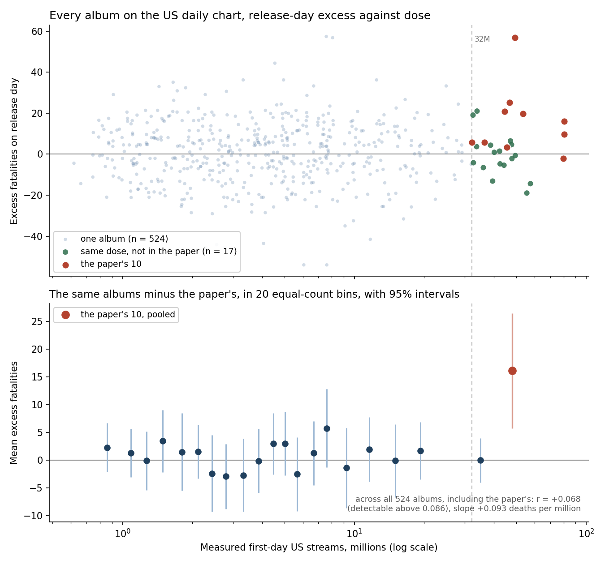

# REPLAY

A replication of Patel, Worsham, Liu & Jena (2026),
"[Smartphones, Online Music Streaming, and Traffic Fatalities](https://www.nber.org/papers/w34866),"
NBER Working Paper 34866 ([local copy](w34866.pdf)).

The paper reports 18.2 extra traffic deaths on the days ten major albums were released and
attributes them to drivers streaming music. We reproduce that estimate almost exactly, and the
day-of-week explanation that suggests itself first does not survive any test we can put to it.
What does not survive is the size: ten treated days cannot detect an effect below 13.4 deaths, and
across the 27 major releases that are not the paper's own the pooled effect is about six.
Measured US streaming volume, which the paper's own dose is not, settles it. Seventeen other albums
had a first day at least as big as the smallest of the paper's ten. Their release days average
−0.49 deaths. The effect belongs to those ten albums, not to releases that size.



Every album on the US daily Spotify chart with a measurable first day, against its release-day
excess fatalities. Red is the paper's ten; green is the 17 other albums that were at least as big.
The lower panel drops the paper's ten and bins the rest: twenty equal-count bins across two orders
of magnitude of dose, none of them distinguishable from zero, including the bin above the paper's
own cutoff.

**The argument is in [ms/ms.pdf](ms/ms.pdf).** This file is the replication index.

## Headline numbers

| | Value | Table |
|---|---|---|
| Replication of the paper's estimate | +17.6 (SE 7.45), 95% CI [0.8, 34.5] | [t12](tabs/t12_paper_replication.md) |
| Ten random Fridays reaching it | 3 in 10,000 | [t18](tabs/t18_friday_placebo.md) |
| Release Friday vs its own adjacent Fridays | +14.11, ratio 1.12 | [t37](tabs/t37_adjacent_friday.md) |
| Same calendar positions, other years | −0.08 (SE 1.48) | [t41](tabs/t41_calendar_position_placebo.md) |
| Smallest effect ten days can detect | 13.4 deaths | [t23](tabs/t23_power_analysis.md) |
| The 27 releases that are not the paper's | +6.49, 95% CI [−0.16, +13.13] | [t20](tabs/t20_extended_series.md) |
| What a true 6.49 publishes, at SE 7.45 | 17.58 | [t36](tabs/t36_publication_filter.md) |
| Weather, from NOAA stations in 51 states | moves it 0.51 deaths | [t43](tabs/t43_exogenous_weather.md) |
| Ambient listening as the shared shock | −0.0074 deaths per million streams (SE 0.0266) | [t44](tabs/t44_shared_shock.md) |
| Albums as big as the paper's smallest, that are not the paper's | −0.49 (SE 2.54) over 17 albums | [t47](tabs/t47_dose_matched.md) |
| Dose-response across every charting album | r = +0.068 over 524, detectable above 0.086 | [t46](tabs/t46_dose_response_all.md) |
| A frame anyone can rebuild, top 10 to top 50 | +13.24 falling to +4.31 | [t45](tabs/t45_reproducible_frame.md) |

Four estimators of one quantity appear in `tabs/`, and each table caption names which it used.
The **regression** estimate (+17.6) is the paper's specification, clustered by album. The
**residual** estimate (+16.1) is the mean deviation of the ten release days from a model fitted
with their windows excluded, and supports the per-album tests. The **benchmark** estimate (+15.45)
is that residual against the coarser baseline the holiday comparison needs. The **local** estimate
(+23.0) subtracts the surrounding twenty days with no adjustment at all.

## Data

FARS 2007-2024, 6,575 days with no gaps; annual totals are gated against the FARS Final File on
every run. Albums: 10 from the paper, plus 27 others across 2015-2024. See
[albums_sources.md](data/albums_sources.md). Tier 1 streaming counts come from the paper's Table 1,
Tier 2 counts are estimated from chart position, and Tier 0 counts are unsourced placeholders that
no dose-response analysis uses.

The daily Spotify Charts top 200 for the US replaces all three where it reaches. It supplies a
measured dose for 524 albums, a comparison set defined by a rule rather than a list, and the
ambient listening series needed to test the one confounder the fatality data alone cannot address.
Our reconstruction matches the paper's on control days (86.8M against their 86.1) and runs 8% high
on release days (133.2M against their 123.3), which we cannot account for and which nothing
downstream depends on. See
[data/spotify/README.md](data/spotify/README.md). Station weather is cached in `data/weather/`.

Source: [NHTSA FARS](https://www.nhtsa.gov/research-data/fatality-analysis-reporting-system-fars)
and [NOAA GHCN](https://www.ncei.noaa.gov/products/land-based-station/global-historical-climatology-network-daily).

## Running it

```bash
pip install -r requirements.txt
make extract      # unpack FARS accident CSVs from data/raw/*.zip
make streaming    # optional: pull the US Spotify Charts series from Kaggle
make run          # full analysis, writes tabs/ and figs/
make ms           # build the manuscript from tabs/
make check-prose  # every number in prose must trace to a table or a macro
make lint         # black, isort, flake8
pytest tests      # regression tests for the audited defects
```

Download the FARS zip files from [NHTSA](https://www.nhtsa.gov/file-downloads) into `data/raw/`
first.

`src/gates.py` runs at the top of every invocation and raises rather than warns if the album list
drifts from the paper's Table 1, if the daily series has gaps, or if annual totals do not match the
Final File. `build_design_matrix` raises on a control column it cannot find, `album_stats` returns
no standard error below five treated units, and `src/numbers.py` emits every number the prose is
allowed to quote.

## Tables

| File | Contents |
|------|----------|
| [t01](tabs/t01_local_estimates.md), [t02](tabs/t02_global_estimates.md) | Per-album local and global effects |
| [t03](tabs/t03_dose_response.md), [t04](tabs/t04_tier_comparison.md) | Streams against effect; Tier 1 against Tier 2 |
| [t05](tabs/t05_randomization_inference.md), [t26](tabs/t26_studentized_ri.md) | Randomization inference |
| [t06](tabs/t06_leave_one_out.md) | Jackknife |
| [t07](tabs/t07_summary.md) | Summary statistics |
| [t09](tabs/t09_window_sensitivity.md), [t29](tabs/t29_multiverse.md) | Window sensitivity and specification curve |
| [t10](tabs/t10_forecast_estimates.md), [t11](tabs/t11_forecast_summary.md) | Forecast-based estimates |
| [t12](tabs/t12_paper_replication.md) | Replication against the paper |
| [t13](tabs/t13_dynamic_effects.md), [t32](tabs/t32_parallel_trends.md) | Event study and pre-trend test |
| [t18](tabs/t18_friday_placebo.md), [t18b](tabs/t18b_cherry_pick_benchmark.md) | Random-Friday placebo; date-selection benchmark |
| [t14](tabs/t14_time_of_day.md), [t19](tabs/t19_covid_sensitivity.md), [t20](tabs/t20_extended_series.md) | Time of day; COVID split; all four album tiers |
| [t21](tabs/t21_fars_controls.md), [t30](tabs/t30_dow_interactions.md) | Weather controls; day-of-week interactions |
| [t22](tabs/t22_alcohol_decomposition.md) | Where the excess sits by driver BAC, ten imputations pooled |
| [t23](tabs/t23_power_analysis.md), [t27](tabs/t27_sensitivity.md) | Power and confounding sensitivity |
| [t34](tabs/t34_holiday_benchmark.md), [t35](tabs/t35_holiday_adjacency.md) | Release days against all nine federal holidays; holiday-adjacency robustness |
| [t36](tabs/t36_publication_filter.md) | What a ten-album study would publish, given a true effect |
| [t37](tabs/t37_adjacent_friday.md), [t38](tabs/t38_weekday_dummy_invariance.md) | Adjacent-Friday contrast; weekday-dummy invariance |
| [t39](tabs/t39_one_day_robustness.md), [t40](tabs/t40_release_day_weather.md) | Rank and trimmed estimates; weather on each release day |
| [t41](tabs/t41_calendar_position_placebo.md), [t42](tabs/t42_composition_covariation.md) | Calendar-position placebo; does the latitude shift track the excess |
| [t44](tabs/t44_shared_shock.md) | Ambient listening as the shared shock |
| [t45](tabs/t45_reproducible_frame.md), [t46](tabs/t46_dose_response_all.md) | A frame built from measured streams; dose-response across every charting album |
| [t47](tabs/t47_dose_matched.md) | The paper's ten against every other album of the same measured size |
| [t24](tabs/t24_balance_check.md) | Covariate balance |
| [t28](tabs/t28_placebo_outcomes.md), [t28b](tabs/t28b_structural_fars_composition.md) | Placebo outcomes; crash composition |
| [t15](tabs/t15_placebo_sp500.md), [t17](tabs/t17_sp500_expanded.md), [t08](tabs/t08_placebo_tests.md), [t16](tabs/t16_holiday_check.md) | S&P 500 and calendar placebos |
| [t25](tabs/t25_multiple_testing.md), [t31](tabs/t31_synthetic_control.md), [t33](tabs/t33_weather_effects.md) | Multiple testing, synthetic control, weather effects |

## References

Patel, Worsham, Liu & Jena (2026), NBER Working Paper 34866
([PDF](w34866.pdf)) ·
[Harvard Gazette](https://news.harvard.edu/gazette/story/2026/02/streaming-a-new-album-release-while-driving-may-increase-risk-of-fatal-car-accidents/) ·
[Freakonomics](https://freakonomics.com/podcast/do-taylor-swift-and-bad-bunny-have-blood-on-their-hands/) ·
[New York Times](https://www.nytimes.com/2026/04/10/well/car-crashes-streaming-friday-harvard.html)
